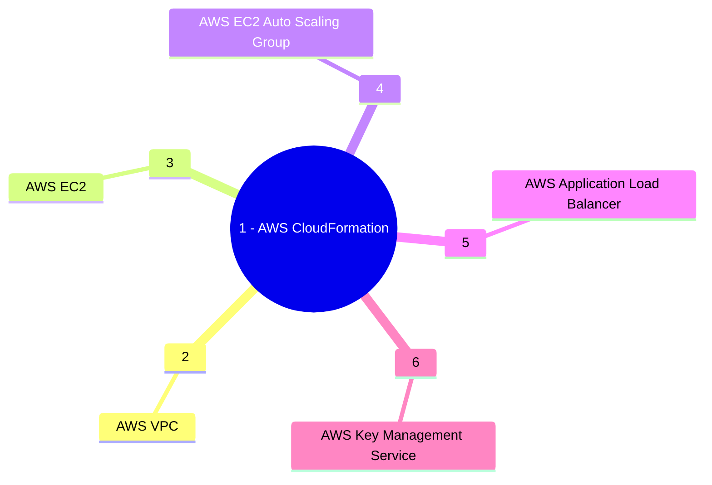

&nbsp;&nbsp;&nbsp;&nbsp;&nbsp;&nbsp;&nbsp;&nbsp;&nbsp;

# Project Hollyhock: An EC2 Auto Scaling Group running web server running behind an Application Load Balancer

This is a demo on creating an EC2 Load Balancer running behind an EC2 Auto Scaling Group.

## Description

This is a demo on creating an EC2 Load Balancer running behind an EC2 Auto Scaling Group.

### Services Used

### Executing program

## Help

:email: Subhamay Bhattacharyya  - [subhamay.aws@gmail.com]

## Authors

Contributors names and contact info

Subhamay Bhattacharyya  - [subhamay.aws@gmail.com]

## Version History

* 0.1
    * Initial Release

## License

This project is licensed under Subhamay Bhattacharyya. All Rights Reserved.

## Acknowledgments

